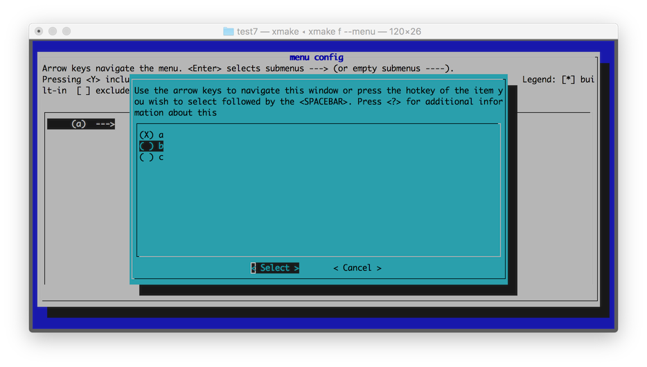
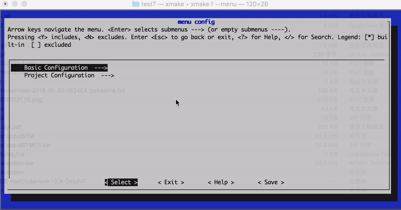

# 描述域

定义和设置选项开关，每个 `option` 对应一个选项，可用于自定义编译配置选项、开关设置。

> 除了 `target` 以外的所有域接口，例如 `option`，`task` 等的接口，默认不能放置在外面的全局作用域中的（除非部分跟 target 共用的接口除外）。
> 如果要设置值影响所有 `option`，`task` 等选项，可以通过匿名全局域来设置。
> 不过我们不推荐这么使用，后续是会废弃掉 `option_end` 接口以保持 xmake.lua 脚本的易读性。

例如：

```lua
-- 进入 option 的匿名全局域，里面的设置会同时影响 test 和 test2 选项
option()
    add_defines("DEBUG")

option("test")
    -- ...
    -- 尽量保持缩进，因为这个之后的所有设置，都是针对 test 选项的

option("test2")
    -- ...
```

> `option` 域是可以重复进入来实现分离设置的，如果要显示离开当前选项的作用域设置，可以手动调用 [option_end](#option_end) 接口。

## option

定义和设置选项开关，可用于自定义编译配置选项、开关设置。

例如，定义一个是否启用 test 的选项：

```lua
option("test", function()
    set_default(false)
    set_showmenu(true)
    add_defines("TEST")
end)
```

然后关联到指定的 target 中去：

```lua
target("demo", function()
    add_options("test")
end)
```

这样，一个选项就算定义好了，如果这个选项被启用，那么编译这个 target 的时候，就会自动加上 `-DTEST` 的宏定义。

```lua
# 手动启用这个选项
$ xmake f --test=y
$ xmake
```

## option_end

这是一个可选 api，显示离开选项作用域，用法和 [target_end](/zh-cn/manual/project_target?id=target_end) 类似。

## option:add_deps

通过设置依赖，可以调整选项的检测顺序，一般用于 [on_check](#optionon_check) 等检测脚本的调用时机。

```lua
option("small", function()
    set_default(true)
    on_check(function (option)
        -- ...
    end)
end)

option("test", function()
    add_deps("small")
    set_default(true)
    after_check(function (option)
        if option:dep("small"):enabled() then
            option:enable(false)
        end
    end)
end)
```

当依赖的 small 选项检测完成后，通过判断 small 选项的状态，来控制 test 的选项状态。

> 由于 on_check 只有在没有设置 default 值的情况下才会被执行，因此如果设置了 default 值，那么可以在 after_check 阶段处理自定义逻辑。

## option:before_check

选项检测之前执行此脚本：

```lua
option("zlib", function()
    before_check(function (option)
    end)
end)
```

## option:on_check

自定义选项检测脚本，此脚本会覆盖内置的选项检测逻辑。

```lua
option("test", function()
    add_deps("small")
    on_check(function (option)
        option:enable(true)
    end)
end)
```

> 仅仅在 `set_default` 没有被设置的情况下，才会执行 `on_check` 进行自定义的选项检测脚本。

## option:after_check

在选项检测完成后，执行此脚本做一些后期处理，也可以在此时重新禁用选项：

```lua
option("test", function()
    add_deps("small")
    add_links("pthread")
    after_check(function (option)
        option:enable(false)
    end)
end)
```

## option:set_values

设置选项值列表，仅用于 `xmake f --menu` 的图形菜单配置时，提供选项值列表供用户快速选择使用，例如：

```lua
option("test", function()
    set_default("b")
    set_showmenu(true)
    set_values("a", "b", "c")
end)
```

效果图如下：



## option:set_default

在没有通过 `xmake f --option=[y|n}` 等命令修改选项值的时候，这个选项本身也是有个默认值的，可以通过这个接口来设置：

```lua
option("test", function()
    -- 默认禁用这个选项
    set_default(false)
end)
```

选项的值不仅支持 boolean 类型，也可以是字符串类型，例如：

```lua
option("test", function()
    set_default("value")
end)
```

| 值类型  | 描述                                     | 配置                                             |
| ------- | ---------------------------------------- | ------------------------------------------------ |
| boolean | 一般用作参数开关，值范围：`true/false` | `xmake f --optionname=[y/n/yes/no/true/false]` |
| string  | 可以是任意字符串，一般用于模式判断       | `xmake f --optionname=value`                   |

如果是 `boolean` 值的选项，可以通过 [has_config](/zh-cn/manual/conditions?id=has_config) 来进行判断，选项是否被启用。

如果是 `string` 类型的选项，可以在内建变量中直接使用，例如：

```lua
-- 定义一个路径配置选项，默认使用临时目录
option("rootdir", function()
    set_default("$(tmpdir)")
    set_showmenu(true)
end)

target("test", function()
    -- 添加指定选项目录中的源文件
    add_files("$(rootdir)/*.c")
end)
```

其中，`$(rootdir)` 就是自定义的选项内建变量，通过手动配置，可以动态修改它的值：

```bash
$ xmake f --rootdir=~/projectdir/src
$ xmake
```

给这个 `rootdir` 选项指定一个其他的源码目录路径，然后编译。

选项的检测行为：

| default 值  | 检测行为                                                                                                                   |
| ----------- | -------------------------------------------------------------------------------------------------------------------------- |
| 没有设置    | 优先手动配置修改，默认禁用，否则会启用自动检测，也会执行 on_check，可根据手动传入的值类型，自动切换 boolean 和 string 类型 |
| false       | 开关选项，不自动检测，默认禁用，可手动配置修改                                                                             |
| true        | 开关选项，不自动检测，默认启用，可手动配置修改                                                                             |
| string 类型 | 无开关状态，不自动检测，可手动配置修改，一般用于配置变量传递                                                               |

## option:set_showmenu

用于设置是否启用菜单显示。

如果设置为 `true`，那么在 `xmake f --help` 里面就会出现这个选项，也就能通过 `xmake f --optionname=xxx` 进行配置，否则只能在 `xmake.lua` 内部使用，无法手动配置修改。

```lua
option("test", function()
    set_showmenu(true)
end)
```

设置为启用菜单后，执行 `xmake f --help` 可以看到，帮助菜单里面多了一项：

```
Options:
    ...

    --test=TEST
```

> 此选项默认改为启用，通常都不需要额外配置它。考虑后面删除这个 api。

## option:set_category

这个是个可选配置，仅用于在帮助菜单中，进行分类显示选项，同一类别的选项，会在同一个分组里面显示，这样菜单看起来更加的美观。

例如：

```lua
option("test1", function()
    set_showmenu(true)
    set_category("test")
end)

option("test2", function()
    set_showmenu(true)
    set_category("test")
end)

option("demo1", function()
    set_showmenu(true)
    set_category("demo")
end)

option("demo2", function()
    set_showmenu(true)
    set_category("demo")
end)
```

这里四个选项分别归类于两个分组：`test` 和 `demo`，那么显示的布局类似这样：

```bash
Options:
    ...

    --test1=TEST1
    --test2=TEST2

    --demo1=DEMO1
    --demo2=DEMO2
```

这个接口，仅仅是为了调整显示布局，更加美观而已，没其他用途。

还可以通过 category 设置分级路径名 `set_category("root/submenu/submenu2")`，来配置 `xmake f --menu` 的图形菜单界面，例如：

```lua
-- 'boolean' option
option("test1", function()
    set_default(true)
    set_showmenu(true)
    set_category("root menu/test1")
end)

-- 'choice' option with values: "a", "b", "c"
option("test2", function()
    set_default("a")
    set_values("a", "b", "c")
    set_showmenu(true)
    set_category("root menu/test2")
end)

-- 'string' option
option("test3", function()
    set_default("xx")
    set_showmenu(true)
    set_category("root menu/test3/test3")
end)

-- 'number' option
option("test4", function()
    set_default(6)
    set_showmenu(true)
    set_category("root menu/test4")
end)
```

上述配置最后显示的菜单界面路径结构：

- root menu
  - test1
  - test2
  - test3
    - test3
  - test4

效果图如下：



## option:set_description

设置选项菜单显示时，右边的描述信息，用于帮助用户更加清楚的知道这个选项的用途，例如：

```lua
option("test", function()
    set_default(false)
    set_showmenu(true)
    set_description("Enable or disable test")
end)
```

生成的菜单内容如下：

```
Options:
    ...

    --test=TEST                       Enable or disable test (default: false)
```

这个接口也支持多行显示，输出更加详细的描述信息，例如：

```lua
option("mode", function()
    set_default("debug")
    set_showmenu(true)
    set_description("Set build mode",
                    "- debug",
                    "- release",
                    "- profile")
end)
```

生成的菜单内容如下：

```
Options:
    ...

    --mode=MODE                       Set build mode (default: debug)
                                          - debug
                                          - release
                                          - profile
```

看到这个菜单，用户就能清楚地知道，定义的这个 `mode` 选项的具体用处，以及如何使用了：

```bash
$ xmake f --mode=release
```

## option:add_links

添加链接库检测。

如果指定的链接库检测通过，此选项将被启用，并且对应关联的 target 会自动加上此链接，例如：

```lua
option("pthread", function()
    add_links("pthread")
    add_linkdirs("/usr/local/lib")
end)

target("test", function()
    add_options("pthread")
end)
```

如果检测通过，`test` 目标编译的时候就会自动加上：`-L/usr/local/lib -lpthread` 编译选项

## option:add_linkdirs

添加链接库检测时候需要的搜索目录。

这个是可选的，一般系统库不需要加这个，也能检测通过，如果确实没找到，可以自己追加搜索目录，提高检测通过率。具体使用见：[add_links](#optionadd_links)

## option:add_rpathdirs

添加程序运行时动态库的加载搜索目录。

在选项通过检测后，会自动添加到对应的 target 上去，具体使用见：[target.add_rpathdirs](/zh-cn/manual/project_target?id=targetadd_rpathdirs)。

## option:add_cincludes

添加 c 头文件检测。

如果 c 头文件检测通过，此选项将被启用，例如：

```lua
option("pthread", function()
    add_cincludes("pthread.h")
    add_defines("ENABLE_PTHREAD")
end)

target("test", function()
    add_options("pthread")
end)
```

此选项检测是否存在 `pthread.h` 的头文件，如果检测通过那么 `test` 目标程序将会加上 `ENABLE_PTHREAD` 的宏定义。

如果想要更加灵活的检测，可以通过 [lib.detect.has_cincludes](#detect-has_cincludes) 在[option.on_check](#optionon_check)中去实现。

## option:add_cxxincludes

添加 c++ 头文件检测。

与 [add_cincludes](#optionadd_cincludes) 类似，只是检测的头文件类型是 c++ 头文件。

## option:add_ctypes

添加 c 类型检测。

如果 c 类型检测通过，此选项将被启用，例如：

```lua
option("wchar", function()
    add_ctypes("wchar_t")
    add_defines("HAVE_WCHAR")
end)

target("test", function()
    add_options("wchar")
end)
```

此选项检测是否存在 `wchar_t` 的类型，如果检测通过那么 `test` 目标程序将会加上 `HAVE_WCHAR` 的宏定义。

如果想要更加灵活的检测，可以通过 [lib.detect.has_ctypes](#detect-has_ctypes) 在[option.on_check](#optionon_check)中去实现。

## option:add_cxxtypes

添加 c++ 类型检测。

与 [add_ctypes](#optionadd_ctypes) 类似，只是检测的类型是 c++ 类型。

## option:add_csnippets

添加 c 代码片段检测。

如果现有的 [add_ctypes](#optionadd_ctypes), [add_cfuncs](#optionadd_cfuncs) 等不能满足当前的检测需求，
可以用这个接口实现更加定制化检测一些编译器特性检测，具体见: [add_cxxsnippets](#optionadd_cxxsnippets)。

## option:add_cxxsnippets

添加 c++ 代码片段检测。

可以用这个接口实现更加定制化检测一些编译器特性检测，尤其是 c++ 的各种特性的检测支持，例如：

```lua
option("constexpr", function()
    add_cxxsnippets("constexpr", "constexpr int f(int x) { int sum=0; for (int i=0; i<=x; ++i) sum += i; return sum; } constexpr int x = f(5);  static_assert(x == 15);")
end)
```

第一个参数设置代码片段的名字作为标示，检测输出信息时候会有显示。

上述代码，实现对 c++ 的 constexpr 特性的检测，如果检测通过，则启用 constexpr 选项，当然这里只是个例子。

对于编译器特性的检测，有更加方便高效的检测模块，提供更强大的检测支持，具体见：[compiler.has_features](#compiler-has_features) 和 [detect.check_cxsnippets](#detect-check_cxsnippets)

如果想要更加灵活的检测，可以通过 [lib.detect.check_cxsnippets](#detect-check_cxsnippets) 在[option.on_check](#optionon_check)中去实现。

另外我们还可以通过 `{tryrun = true}` 和 `{output = true}` 两个选项用于尝试运行检测和捕获输出。

设置 tryrun 可以尝试运行来检测：

```lua
option("test", function()
    add_cxxsnippets("HAS_INT_4", "return (sizeof(int) == 4)? 0 : -1;", {tryrun = true})
end)
```

设置 output 也会尝试去检测，并且额外捕获运行的输出内容。

```lua
option("test", function()
    add_cxxsnippets("INT_SIZE", 'printf("%d", sizeof(int)); return 0;', {output = true, number = true})
end)
```

> 设置为捕获输出，当前 option 不能再设置其他 snippets。

我们也可以通过 `is_config` 获取绑定到 option 的输出。

```lua
if is_config("test", "8") tben
    -- xxx
end
```

## option:add_cfuncs

添加 c 库函数检测。

```lua
option("setjmp", function()
    add_cincludes("setjmp.h")
    add_cfuncs("sigsetjmp", "setjmp")
    add_defines("HAVE_SETJMP")
end)

target("test", function()
    add_options("setjmp")
end)
```

此选项检测是否存在 `setjmp` 的一些接口，如果检测通过那么 `test` 目标程序将会加上 `HAVE_SETJMP` 的宏定义。

里面的函数片段支持下面几种语法格式：

```lua
-- 单纯检测函数地址是否存在，内部会尝试去它的地址来判断
sigsetjmp

-- 如果有些函数是宏定义 wrap 的，可以通过这种方式绕通过检测
sigsetjmp((void*)0, 0)

-- 也可以指定一个完整函数语句，例如：funcname{codebody}
sigsetjmp{sigsetjmp((void*)0, 0);}
sigsetjmp{int a = 0; sigsetjmp((void*)a, a);}
```

注意，检测的函数通常需要附带 `add_cincludes` 确保函数能够被正常 include 进来，否则检测会失败。

## option:add_cxxfuncs

添加 c++ 库函数检测。

用法跟 [option:add_cfuncs](#optionadd_cxxfuncs) 一致。
